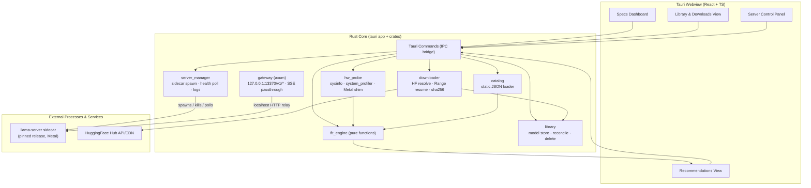
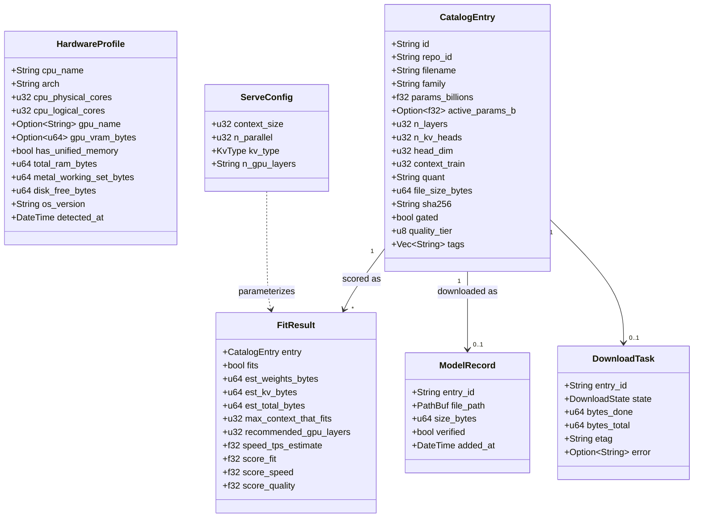
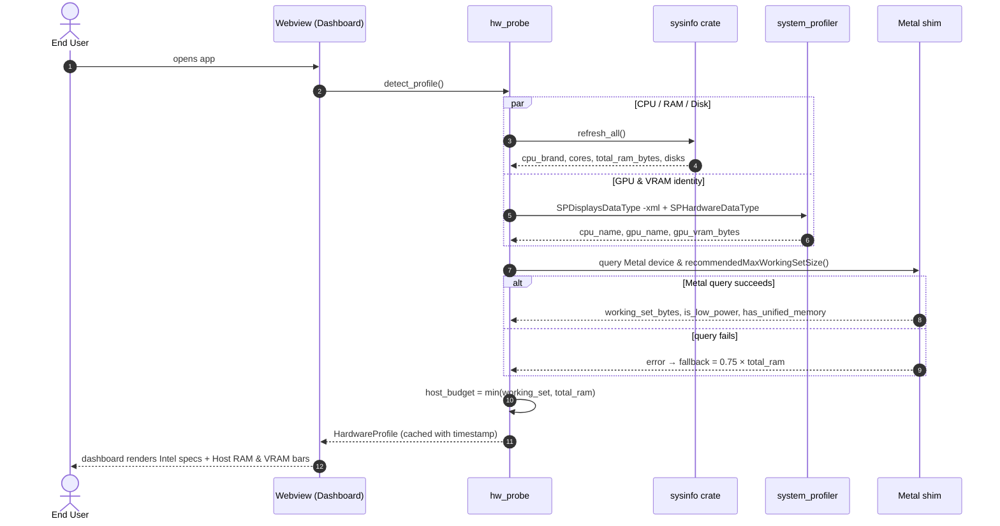
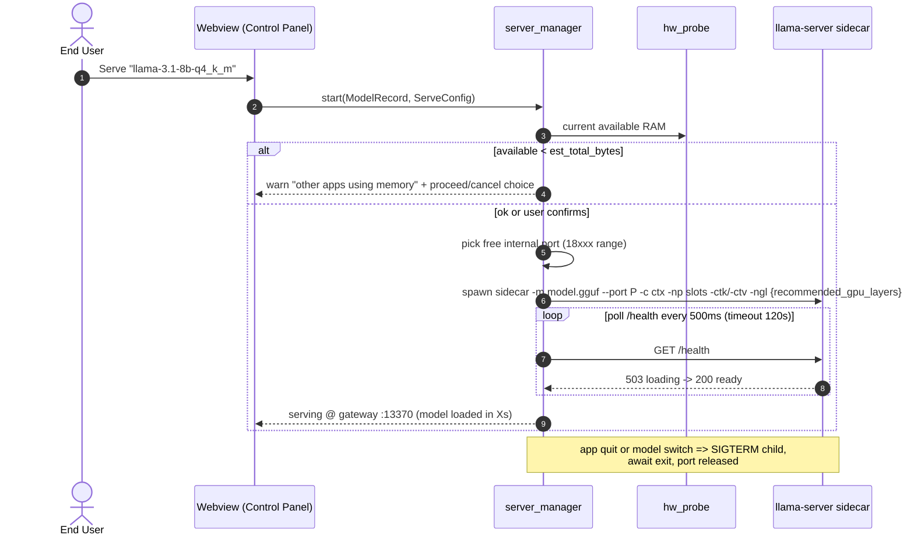
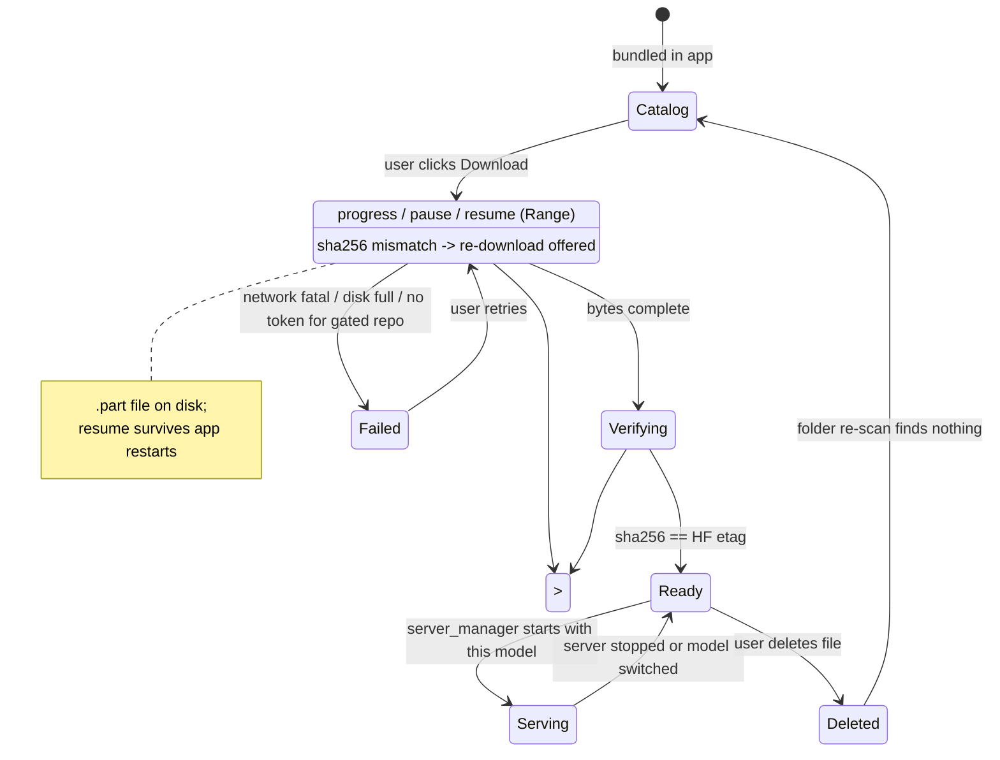
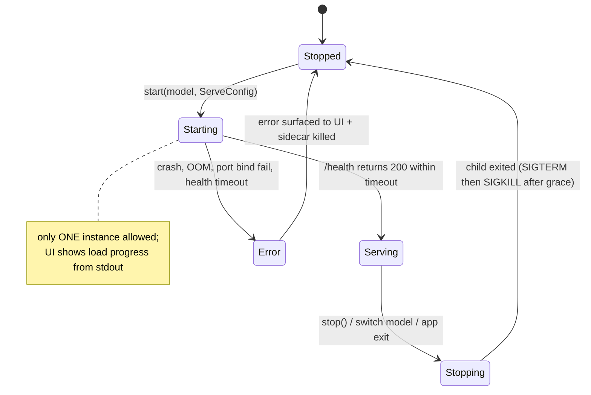
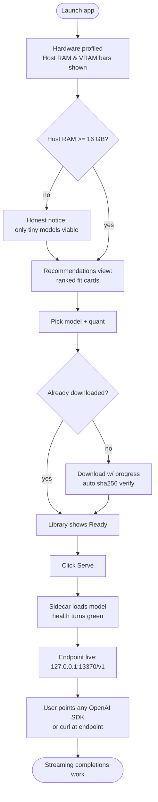
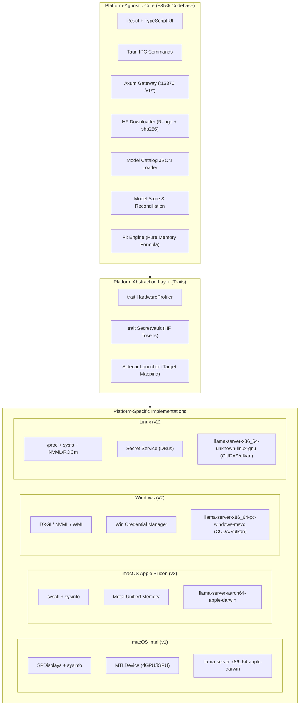

# LLM Advisor — System Design Document

## TL;DR

> **What**: A self-contained macOS (Apple Intel x86_64) desktop app that profiles your hardware, recommends open LLMs that actually fit in memory, downloads them from HuggingFace, and serves an OpenAI-compatible inference endpoint backed by a bundled llama.cpp `llama-server`.
>
> **Stack**: Tauri 2.x · Rust core · web UI · bundled llama-server x86_64 sidecar (MIT)
>
> **Status artifact for**: `.sisyphus/plans/llm-advisor-mvp.md` (implementation plan). Diagrams are Mermaid — render natively on GitHub and VS Code.

---

## 1. Context & Goals

### Original Request
Build a desktop app that retrieves local machine specs (RAM, VRAM, Disk…), suggests open LLM models that can run on it, and provides an inference endpoint (like Ollama). Start with system design: use cases and workflows as UML.

### Product Goals
- **G1** — Accurate Apple Intel hardware profiling (Intel CPU cores, host RAM, discrete/integrated GPU VRAM, disk free)
- **G2** — Trustworthy model-fit recommendations with *quantified* memory math (not vibes)
- **G3** — One-click model acquisition (download → verify → manage) from HuggingFace
- **G4** — A stable, local OpenAI-compatible API (`/v1/chat/completions`) any existing tool can consume
- **G5** — Self-contained: no Ollama install, no Python runtime, no manual llama.cpp builds

### Non-Goals / Out of Scope for v1 (LOCKED)
| Excluded | Rationale |
|---|---|
| Windows / Linux / Apple Silicon Mac | v1 is Apple Intel (x86_64 macOS) only; graceful "unsupported" screen elsewhere (Apple Silicon deferred to v2) |
| Wrapping/driving Ollama | Chose embedded llama.cpp instead |
| Using llmfit as dependency | Algorithmic reference ONLY |
| Bundling GGUF weights in the app | Licensing + multi-GB payloads; ship metadata only |
| Multi-model concurrent serving / router mode | llama-server loads ONE model; switching = restart |
| Online catalog auto-refresh | Static bundled catalog in v1; refresh is v2 |
| Chat playground rich features (history/sessions/RAG/file upload) | Minimal single-conversation tester arrives in Phase 4 |
| Function/tool calling UI, embeddings UI | Server supports both; UI exposure deferred |
| Signed/notarized distributable .dmg | v1 = local build & run (`tauri dev` / local bundle); signing documented as future work |
| LAN exposure of endpoint | Bind 127.0.0.1 only — hard security guardrail |

### Actors
| Actor | Type | Description |
|---|---|---|
| End User | Primary | Human running the desktop app |
| External AI Client | Primary (system) | Anything speaking OpenAI protocol: Python/JS OpenAI SDKs, curl, IDE extensions, agent frameworks |
| HuggingFace Hub | Secondary (system) | Source of GGUF files + metadata (resolve URLs, ETag=sha256, Range resumption) |
| llama-server | Internal (process) | Bundled MIT x86_64 sidecar doing actual inference over Metal (discrete/integrated GPU) and AVX2/CPU |

### Assumptions & Constraints
- Target: Apple Intel Macs (x86_64, Core i3/i5/i7/i9, Xeon, 2017–2020 models). Unlike Apple Silicon unified memory, Intel Macs feature host system RAM (DDR4/LPDDR4) plus optional discrete GPU VRAM (AMD Radeon Pro 4GB/8GB/16GB GDDR5/GDDR6/HBM2) or shared integrated VRAM (Intel Iris/UHD).
- Memory Model: Dual-budget aware:
  1. **Host RAM Budget**: Governs whether a model fits in system memory to run locally = `min(host_working_set_bytes, total_ram_bytes)` (runtime Metal buffer ceiling or 75% host RAM fallback).
  2. **dGPU VRAM Budget**: Dedicated VRAM on discrete AMD GPUs (queried via `MTLDevice` / `SPDisplaysDataType`) determines GPU acceleration level (`-ngl` offloaded layers).
- `MTLDevice` queried at **runtime** (native shim) to detect Metal GPU devices, dedicated VRAM, and working-set limits; 75%-of-RAM is host memory fallback.
- llama-server is pinned to a fixed upstream `x86_64-apple-darwin` release + sha256 (supply-chain guard).
- v1 supports **gated-model downloads** by letting the user paste a HuggingFace token in Settings.
- Endpoint serves **one loaded model at a time**; switching models restarts the sidecar.
- Frontend framework: **React + TypeScript + Vite** (default applied; swap-friendly since backend owns all logic via Tauri IPC).

### Ground-Truth Math (from research, validated sources)
```
memory_needed(ServeConfig) =
    weights_bytes            // catalog stores exact GGUF file_size_bytes (ground truth)
  + kv_cache_bytes           // 2 × n_layers × n_kv_heads × head_dim × ctx × bytes_per_elem(f16=2)
                             // ⚠️ n_kv_heads = GQA value (e.g. Llama-3.1-8B: 8, NOT n_head=32)
                             // × n_parallel slots when >1
  + activations_margin       // ≈ 5% of weights (safety margin, not literal peak)
  + runtime_overhead         // ≈ 0.5–0.7 GB floor
host_budget = min(metal_working_set_bytes, total_ram_bytes)
gpu_vram_budget = dgpu_vram_bytes // if dGPU present (0 for integrated/CPU)
verdict:
  - needed ≤ host_budget → FIT; else compute max_context_that_fits by solving ctx down
  - if dGPU present: full_gpu if needed ≤ gpu_vram_budget, partial_gpu if gpu_vram_budget > 0 (n_gpu_layers computed), else cpu_ram
speed_estimate ∝ memory_bandwidth / active_params
  (Intel DDR4 bandwidth ≈ 30–50 GB/s for CPU; dGPU GDDR bandwidth ≈ 192–394 GB/s when offloaded; MoE: active_params)
```

---

## 2. Use Cases

Mermaid has no native use-case diagram type; the flowchart below follows UML use-case conventions: actors outside, oval-shaped use cases inside the system boundary, `-->` = associates/initiates.

```mermaid
flowchart LR
    User(["👤 End User"])
    Client(["🔌 External AI Client<br/>(OpenAI SDK / curl / IDE)"])
    HF(["☁️ HuggingFace Hub"])

    subgraph system["LLM Advisor (macOS desktop app)"]
        UC1(["UC1 · View Hardware Profile"])
        UC2(["UC2 · Detect / Refresh Machine Specs"])
        UC3(["UC3 · Get Model Recommendations"])
        UC4(["UC4 · Browse Model Catalog"])
        UC5(["UC5 · Configure Serving Preferences"])
        UC6(["UC6 · Download Model GGUF"])
        UC7(["UC7 · Verify Model Integrity"])
        UC8(["UC8 · Manage Local Models"])
        UC9(["UC9 · Start / Stop Inference Server"])
        UC10(["UC10 · Serve OpenAI-Compatible API"])
        UC11(["UC11 · Monitor Server Status & Logs"])
    end

    User --> UC1 & UC2 & UC4 & UC5 & UC6 & UC8 & UC9 & UC11
    UC1 -.includes.-> UC2
    UC3 -.includes.-> UC2
    UC6 -.includes.-> UC7
    UC9 -.includes.-> UC10
    Client --> UC10
    HF -.-"downloads / metadata"-.-> UC6
```

### Use Case Catalog

| ID | Use Case | Primary Actor | Summary | Phase |
|----|----------|--------------|---------|-------|
| UC1 | View Hardware Profile | End User | Dashboard shows Intel CPU model, core counts, host RAM, GPU name & VRAM (AMD dGPU / Intel iGPU), disk free | 1 |
| UC2 | Detect / Refresh Specs | End User | Probe via sysinfo + system_profiler (SPHardwareDataType, SPDisplaysDataType) + Metal shim; cache profile with timestamp; re-run on demand | 1 |
| UC3 | Get Model Recommendations | End User | Fit engine scores every catalog entry against current profile + ServeConfig → ranked list with per-model verdict, est. memory, max-context-that-fits, speed/quality/context scores | 1 |
| UC4 | Browse Model Catalog | End User | Filter/search ~30–50 curated entries by family, size, quantization, license | 1 |
| UC5 | Configure Preferences | End User | Context size, parallel slots (default 1), KV-cache type (f16 default), HF token for gated models, ports | 2 |
| UC6 | Download Model | End User | Stream GGUF from HF resolve URL with progress %, cancel, pause/resume (Range requests), disk pre-flight check | 2 |
| UC7 | Verify Integrity | System (included) | sha256(downloaded) must equal HF LFS ETag before model is marked Ready | 2 |
| UC8 | Manage Local Models | End User | List downloaded models with sizes, delete to reclaim disk, re-scan folder if user touched files manually | 2 |
| UC9 | Start/Stop Server | End User | Spawn pinned llama-server sidecar with chosen model + ServeConfig; health-poll until ready; clean kill on stop/switch/app-exit; port-conflict handling | 3 |
| UC10 | Serve OpenAI API | External AI Client | Stable `127.0.0.1:{gateway_port}/v1/*` endpoint proxying llama-server incl. SSE streaming passthrough | 3 |
| UC11 | Monitor Status & Logs | End User | Live server state, tokens/sec from response stats, tail of sidecar stdout/stderr, memory headroom | 3 |

**Future (documented, not built in v1)**: chat playground tester (Phase 4), online catalog refresh, multi-model router, signed distribution.

---

## 3. Component Architecture



**Key structural rules**
- `fit_engine` is a **pure function layer**: `(HardwareProfile, CatalogEntry, ServeConfig) → FitResult`. No I/O, fully TDD-able.
- The **gateway owns the public port** (default `13370`); llama-server binds an internal auto-picked localhost port. External clients never touch the sidecar port.
- `server_manager` is the **only** component allowed to spawn/kill processes; guarantees child cleanup on app exit and model switch.
- All UI↔backend traffic goes through Tauri IPC commands; the gateway exists for *external* clients and to bypass webview CORS.

---

## 4. Core Data Model



**Field notes (correctness-critical)**
- `n_kv_heads` is the **GQA key/value head count** (Llama-3.1-8B → 8, not `n_head` = 32). Sourcing it wrong inflates KV estimates ~4× and is the #1 way this engine ships broken.
- `head_dim` stored explicitly (Gemma-family models deviate from `hidden/n_head`).
- `file_size_bytes` + `sha256` are captured from HuggingFace at catalog-authoring time — file size beats formula for weights; sha256 equals the LFS ETag used later for verification.
- `gpu_vram_bytes` and `has_unified_memory` capture discrete GPU VRAM (e.g. AMD Radeon Pro 5500M 4GB/8GB) vs shared system memory on Intel Macs.
- `recommended_gpu_layers` computes how many transformer layers can be offloaded to dGPU VRAM via `-ngl` without causing VRAM paging/OOM.
- `metal_working_set_bytes` comes from the runtime Metal query with the 75% host RAM heuristic as fallback.
- MoE entries fill `active_params_b`; host/VRAM math uses total params, speed math uses active.

---

## 5. Workflow Sequence Diagrams

### SD1 — Launch & Hardware Detection (UC1/UC2)



### SD2 — Model Recommendation (UC3)

```mermaid
sequenceDiagram
    autonumber
    actor U as End User
    participant UI as Webview (Recommendations)
    participant IPC as Tauri Commands
    participant CAT as catalog
    participant FIT as fit_engine

    U->>UI: open Recommendations (ctx slider at 4096)
    UI->>IPC: recommend(profile, ServeConfig)
    IPC->>CAT: load_entries()
    CAT-->>IPC: Vec<CatalogEntry>
    loop each CatalogEntry × its quants
        IPC->>FIT: evaluate(profile, entry, cfg)
        FIT->>FIT: weights = file_size_bytes
        FIT->>FIT: kv = 2×n_layers×n_kv_heads×head_dim×ctx×2B×n_parallel
        FIT->>FIT: total = w + kv + 0.05w + 0.7GB floor
        alt total ≤ budget
            FIT->>FIT: fits=true · solve max_context_that_fits upward
        else over budget
            FIT->>FIT: solve max_context_that_fits downward; fits=false below min ctx
        end
        FIT->>FIT: score fit/speed/quality dims
        FIT-->>IPC: FitResult
    end
    IPC-->>UI: ranked FitResults (fit first, then speed)
    UI-->>U: cards with verdict badge, GB breakdown, max-ctx, tps estimate
```

**Note**: `max_context_that_fits` is solved by binary-searching ctx ∈ [512, context_train] against the budget — never exceeding `context_train` (llama-server would cap it anyway).

### SD3 — Model Download with Resume & Verification (UC6/UC7)

```mermaid
sequenceDiagram
    autonumber
    actor U as End User
    participant UI as Webview (Library)
    participant DL as downloader
    participant LIB as library
    participant HF as HuggingFace

    U->>UI: click Download on entry
    alt entry.gated AND no token saved
        UI-->>U: prompt for HF token (Settings)
        U->>UI: paste token (stored in Keychain)
    end
    UI->>DL: start(entry)
    DL->>HF: HEAD /repo/resolve/main/file.gguf
    HF-->>DL: ETag (=sha256) · Content-Length
    DL->>LIB: preflight(disk_free >= size + margin)
    alt insufficient disk
        LIB-->>UI: error "need X GB free" - no transfer starts
    else ok
        loop streamed chunks (Range: bytes=N-)
            DL->>HF: GET bytes -> append to .part file
            DL-->>UI: progress %, MB/s
        end
        opt connection drops mid-transfer
            UI->>DL: resume() -> Range from bytes_done
        end
        DL->>DL: sha256(file) == etag ?
        alt checksum OK
            DL->>LIB: rename .part -> final; ModelRecord(verified=true)
            DL-->>UI: Ready
        else mismatch
            DL->>LIB: delete corrupt file; state=failed
            DL-->>UI: checksum failure -> offer re-download
        end
    end
```

### SD4 — Start Serving a Model (UC9)



### SD5 — External Client Inference (UC10)

```mermaid
sequenceDiagram
    autonumber
    participant EXT as External AI Client<br/>(OpenAI SDK / curl)
    participant GW as Gateway axum :13370
    participant LS as llama-server :18xxx

    EXT->>GW: POST /v1/chat/completions {"stream":true,...}
    GW->>GW: verify server state = serving (else 503 + hint JSON)
    GW->>LS: relay request verbatim (localhost hop)
    LS-->>GW: SSE stream chunks
    GW-->>EXT: SSE passthrough - zero buffering
    Note over GW,LS: GET /v1/maps loaded model alias;<br/>non-stream chat/completions also supported
```

---

## 6. Lifecycle State Machines

### Model Lifecycle (per catalog entry)



### Server Lifecycle (singleton)



**Invariant**: `Serving` state exists iff exactly one healthy llama-server child is alive; gateway returns structured 503 JSON in every other state.

---

## 7. End-to-End User Journey



---

## 8. API Contract (Public Gateway)

Base URL: `http://127.0.0.1:13370` — localhost binding is a hard requirement.

| Method | Path | Behavior |
|--------|------|----------|
| GET | `/v1/models` | Lists the single loaded model (OpenAI `Model` object shape); empty list + state hint when nothing served |
| POST | `/v1/chat/completions` | OpenAI-compatible; `stream:true` → SSE passthrough without buffering |
| POST | `/v1/completions` | Legacy completions relayed to sidecar |
| GET | `/healthz` | App-level health: `{ "state": "serving", "model": "...", "uptime_s": N }` |
| * | anything else | Structured JSON errors, never HTML |

**Error envelope** (gateway-generated, when sidecar isn't serving):
```json
{ "error": { "message": "No model is being served. Start one from the app.", "type": "server_not_running", "code": 503 } }
```

---

## 9. Architecture Decision Records

| # | Decision | Rationale | Alternatives rejected |
|---|----------|-----------|----------------------|
| ADR-1 | **Tauri 2.x over Electron/Python/native** | Small binary, Rust shares language with fit engine & process control; user choice | Electron (~150MB runtime); Python packaging fragility |
| ADR-2 | **Embed llama.cpp sidecar** vs wrap Ollama | Self-contained product; MIT both ways; Ollama adds 100–200MB + external dependency | Hybrid detect-Ollama-first (deferred; possible v2 enhancement) |
| ADR-3 | **Thin axum gateway in front of llama-server** | Stable public port decoupled from auto-picked sidecar port; bypasses webview CORS for any future in-app fetch; structured 503 semantics when idle; lets us later add auth/multi-model without breaking clients | Exposing sidecar port directly (no CORS story, unstable port) |
| ADR-4 | **One model served at a time** | llama-server loads a single `-m`; router mode is out of scope; restart-to-switch keeps lifecycle simple | Multi-instance / router |
| ADR-5 | **Static catalog with author-time HF metadata** | Exact `file_size_bytes` + `sha256` captured once at curation time beat param-count estimates and enable checksum verification offline | Live registry queries (v2 refresh feature) |
| ADR-6 | **Own fit engine informed by llmfit** | Portfolio learning value + full control of formula; llmfit's 4-dim scoring (fit/speed/quality/context) adopted conceptually | Vendoring llmfit-core as dependency |
| ADR-7 | **Runtime Metal & VRAM query** | `recommendedMaxWorkingSetSize` and `SPDisplaysDataType` VRAM query detects discrete AMD GPU vs Intel iGPU and host memory limits; 75% host RAM fallback | Hardcoded tables |
| ADR-8 | **TDD on pure logic modules** (`fit_engine`, catalog parsing, downloader chunking, hw_probe parsers) | Estimation correctness is the product's core claim; golden tests against known models catch regressions like the kv-heads bug | Test-after-only |
| ADR-9 | **Trait Seams for Hardware Probing & Secret Vault** | `HardwareProfiler` and `SecretVault` traits allow single codebase to compile natively for macOS Intel, Apple Silicon, Windows, and Linux via `#[cfg(target_os = "...")]` | Platform-specific forks |
| ADR-10 | **Decoupled Heavy Model Storage** | Store GGUF weights in `app_local_data_dir/models` (outside the app bundle, user-configurable to external drives); app updates via Tauri Updater replace binaries without touching weights | Storing weights inside bundle or cache |

---

## 10. Edge Cases & Error Handling

| # | Scenario | Detection | App behavior |
|---|----------|-----------|--------------|
| E1 | Non-Apple-Intel Mac (Apple Silicon / non-macOS / Windows / Linux) | arch/chip probe at startup (arch != x86_64 or vendor != GenuineIntel) | Full-screen "Unsupported platform (Apple Intel macOS required in v1)" notice; no features |
| E2 | Gated HF model without token | 401/403 from resolve HEAD | Prompt for token in Settings; catalog shows 🔒 badge |
| E3 | Insufficient disk before download | pre-flight vs Content-Length + 5% margin | Refuse *before* transfer with GB numbers |
| E4 | Network drop mid-download | IO error / stale progress | Auto-retry with Range resume; exponential backoff ×3 then surface |
| E5 | Corrupt download | sha256 ≠ ETag at verify | Delete file, mark Failed, offer re-download |
| E6 | Gateway port 13370 occupied | bind failure at startup | Try next port, display actual endpoint prominently; setting to pin |
| E7 | Sidecar internal-port collision | spawn args use OS-assigned free port | Retry with new port (max 3) |
| E8 | Runtime OOM despite fit verdict | sidecar exit / health loss while Serving | Kill child, state=Error, suggest lower ctx or smaller quant; log captured |
| E9 | Requested ctx > `context_train` | fit engine clamp + sidecar cap warning | Clamp UI input; show "capped at trained context" hint |
| E10 | Other apps consuming RAM at serve time | available < est_total pre-flight | Warning dialog with proceed/cancel (never silent) |
| E11 | User deletes/moves GGUF manually | library reconcile scan on launch | Mark record missing; remove from Ready list |
| E12 | Model family unsupported by pinned llama.cpp | load failure in Starting state | Error names the architecture; suggest catalog alternative |
| E13 | App quit while serving | window close handler | Guaranteed SIGTERM → SIGKILL child teardown |
| E14 | HF rate limit / CDN flake | 429 / timeouts | Backoff retry; clear status in DownloadTask.error |
| E15 | Multiple quants per model | catalog entries share base model | Grouped cards; default = Q4_K_M tier |

---

## 11. Phased Delivery Roadmap

| Phase | Scope (use cases) | Exit criteria |
|-------|-------------------|---------------|
| **1 — Profile & Recommend** (MVP core) | UC1–UC4 | `cargo test` green on hw_probe + fit_engine goldens; dashboard renders real specs; recommendations ranked with memory breakdowns |
| **2 — Acquire** | UC5–UC8 | Small public GGUF downloads end-to-end: resume works, checksum verifies, disk pre-flight blocks over-download |
| **3 — Serve** | UC9–UC11 | Bundled sidecar serves a downloaded model; external curl gets streaming completions via gateway; clean stop/switch/quit |
| **4 — Polish** (optional post-MVP) | Minimal chat tester, settings hardening, app icon/DMG prep | Playground round-trip through own gateway |

Each phase is independently demonstrable — Phase 1 alone is already a useful portfolio artifact ("it knows what my machine can run").

---

## 12. Multi-Platform Architecture Strategy (Scaling Beyond v1)

LLM Advisor is structured so that **~85% of the codebase** (gateway, downloader, library store, catalog, pure fit engine math, IPC contracts, and React UI) is 100% platform-agnostic. Expanding to Apple Silicon, Windows, and Linux requires zero changes to core business logic.



### 12.1 Platform Hardware Probing Matrix
| Platform | Hardware Query Mechanism | GPU / Accelerator Backend |
|---|---|---|
| **macOS Intel** (v1) | `sysinfo` + `SPDisplaysDataType` + `MTLDevice` | Metal (AMD dGPU VRAM or Intel iGPU) + CPU AVX2 |
| **macOS Apple Silicon** (v2) | `sysinfo` + `sysctl hw.memsize` + `MTLDevice` | Metal Unified Memory (no VRAM split) |
| **Windows 10/11** (v2) | `sysinfo` + DXGI / NVML (`nvml-wrapper` crate) | NVIDIA CUDA (`cudart`), AMD ROCm, Vulkan, or CPU |
| **Linux (Ubuntu/Arch/etc.)** (v2) | `/proc/meminfo`, `libudev`, NVML, `rocm-smi` | NVIDIA CUDA, AMD ROCm/HIP, Vulkan, CPU |

### 12.2 Multi-Target Sidecar Mapping
Tauri 2 dynamically resolves the bundled `llama-server` binary using target triple suffixes:
- `src-tauri/binaries/llama-server-x86_64-apple-darwin` (macOS Intel)
- `src-tauri/binaries/llama-server-aarch64-apple-darwin` (macOS Apple Silicon)
- `src-tauri/binaries/llama-server-x86_64-pc-windows-msvc.exe` (Windows x64)
- `src-tauri/binaries/llama-server-x86_64-unknown-linux-gnu` (Linux x64)

---

## 13. App Lifecycle Management (Install, Updates, Uninstall)

### 13.1 Distribution & Packaging Matrix
- **macOS**: `.dmg` (drag-and-drop installer) and standalone `.app` bundle, codesigned with Apple Developer ID and notarized via `notarytool`.
- **Windows**: `.msi` (WiX enterprise installer) or `.exe` via NSIS installer. Code-signed via SignTool.
- **Linux**: Standalone `.AppImage` (runs on all glibc distros) and native `.deb` / `.rpm` packages.

### 13.2 Directory Separation (Multi-GB Weights vs App State)
To ensure safety during updates and allow storing weights on external drives:

| Data Type | Purpose | macOS Path | Windows Path | Linux Path |
|---|---|---|---|---|
| **App Binaries** | Read-only app code | `/Applications/LLM Advisor.app` | `C:\Program Files\LLM Advisor\` | `/usr/bin/` or AppImage mount |
| **App Config & Logs** | Small JSON files (<100KB) | `~/Library/Application Support/dev.yoel3imari.llm-advisor/` | `%APPDATA%\dev.yoel3imari.llm-advisor\` | `~/.config/llm-advisor/` |
| **Model Store (GGUF)** | Multi-GB weights (1GB–50GB) | `~/Library/Application Support/dev.yoel3imari.llm-advisor/models/` *(Configurable in Settings)* | `%LOCALAPPDATA%\llm-advisor\models\` | `~/.local/share/llm-advisor/models/` |
| **Secrets** | HF Access Token | macOS Keychain | Windows Credential Manager | Linux Secret Service (libsecret) |

### 13.3 Cryptographically Verified Auto-Updates
Tauri 2 `@tauri-apps/plugin-updater` is integrated against GitHub Releases:
- **Minisign ed25519 Signatures**: Every release binary is signed at build time; the public key is embedded in `tauri.conf.json`.
- **Atomic In-Place Replacement**: Updates replace the application binary executable only. **All downloaded models and user settings remain untouched** because they reside in decoupled data directories.
- **Background Checks**: App polls `latest.json` on startup or on demand in Settings, prompting the user with a 1-click "Update & Restart" dialog.

### 13.4 Uninstallation & Multi-GB Disk Cleanup Strategy
Because GGUF model weights take 10GB–100GB+ of space, standard OS app deletion could leave orphan weights. The lifecycle strategy provides:
1. **In-App "Storage & Cleanup" Controls (Settings)**:
   - **"Purge Downloaded Models"**: One-click disk space reclamation without clearing settings.
   - **"Factory Reset / Prepare for Uninstall"**: Cleans Keychain token, wipes model directory, and deletes configuration files.
2. **Windows NSIS Uninstaller Hook**:
   - NSIS script prompts: *"Would you like to delete downloaded LLM models ({SIZE}) to reclaim disk space?"*
3. **macOS & Linux Documentation**:
   - Explicit instructions and in-app clean-removal helper to ensure zero orphaned disk footprint.
