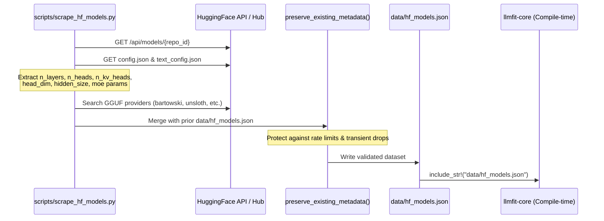

# Deep Architectural & Engineering Analysis: `llmfit-core`

This document provides a comprehensive technical breakdown of [`AlexsJones/llmfit`](https://github.com/AlexsJones/llmfit) (specifically `llmfit-core`), examining how it conducts hardware profiling, calculates model memory fitness and token throughput, scrapes/manages model metadata, and caches community benchmarks. It concludes with an architectural roadmap for integrating these patterns into **`llm-advisor`**.

---

## 1. Executive Summary & Context

During download validation in `llm-advisor`, certain models encountered HTTP `404` or `401` errors due to outdated repository identifiers and HuggingFace gated licensing constraints. Investigating `AlexsJones/llmfit` revealed production-grade engineering patterns for:
1. **Dynamic Hardware Probing**: Multi-backend detection with container/sysfs fallbacks and 64-bit VRAM registry overrides.
2. **Hardware Memory Bandwidth Roofline Estimation**: Predicting inference speed ($\text{tok/s}$) directly from GPU memory bandwidth.
3. **Adaptive Context Sizing (`usable_context`)**: Capping initial fit estimation to typical working context ($8\text{k}$) and calculating true usable context without false "Too Tight" rejections.
4. **Automated Metadata Ingestion**: Programmatically extracting transformer architecture parameters (`n_kv_heads`, `head_dim`, `n_layers`, `moe_intermediate_size`) from HuggingFace `config.json` files.

---

## 2. Hardware Profiling & Detection (`hardware.rs`)

`llmfit-core` implements an exhaustive hardware inspection strategy across operating systems and GPU vendors:

```mermaid
flowchart TD
    Start([Hardware Probe]) --> DetectOS{Operating System}
    
    DetectOS -->|macOS| MetalProbe[sysinfo + Metal API<br/>recommendedMaxWorkingSetSize]
    DetectOS -->|Linux| LinuxGPUs[Scan GPU Backends]
    DetectOS -->|Windows| WinProbe[PowerShell WMI + 64-bit Registry<br/>HardwareInformation.qwMemorySize]
    
    LinuxGPUs --> NV[NVIDIA Probe]
    NV -->|Primary| NVSMI[nvidia-smi CSV query]
    NV -->|Fallback| NVSysfs[/sys/class/drm sysfs + lspci]
    
    LinuxGPUs --> AMD[AMD Probe]
    AMD -->|Primary| ROCM[rocm-smi query]
    AMD -->|Fallback| AMDSysfs[/sys/class/drm vendor 0x1002]
    AMD --> FilterIGPU[Filter iGPUs <= 2GB when dGPU present]
    
    LinuxGPUs --> APU[Unified Memory SoCs]
    APU --> MatchAPU{Strix Halo / Grace / Tegra?}
    MatchAPU -->|Yes| SetUMA[Override VRAM with System RAM Pool]
    
    MetalProbe --> OutSpecs[(SystemSpecs)]
    WinProbe --> OutSpecs
    FilterIGPU --> OutSpecs
    SetUMA --> OutSpecs
```

### Key Detection Mechanisms

1. **Linux Sysfs DRM & Container Fallback**:
   * When `nvidia-smi` or `rocm-smi` are missing (e.g. inside Docker containers or Fedora Toolbx), `llmfit` scans `/sys/class/drm/card*/device/`:
     * NVIDIA vendor ID: `0x10de`
     * AMD vendor ID: `0x1002`
   * Reads `/sys/class/drm/card*/device/mem_info_vram_total` directly from the kernel DRM subsystem.
   * Resolves human-readable device names from `PCI_SLOT_NAME` using `lspci -nnD` (with `flatpak-spawn --host` fallback).
2. **AMD Integrated GPU (iGPU) Filtering**:
   * `rocm-smi` enumerates all GPU agents including small APU iGPUs (e.g., Ryzen 9800X3D integrated graphics with $\le 2\text{ GB}$).
   * When discrete GPUs ($> 2\text{ GB}$) are detected, iGPUs are automatically filtered out so multi-GPU aggregation reflects true discrete capacity.
3. **Unified Memory APUs & SoCs (Strix Halo, NVIDIA Grace)**:
   * Detects AMD Ryzen AI MAX / Strix Halo and NVIDIA Grace / Tegra architectures.
   * Recognizes that the GPU can access the complete host RAM pool, overriding 32-bit `AdapterRAM` caps.
4. **Windows 64-bit VRAM Registry Override**:
   * `Win32_VideoController.AdapterRAM` in WMI is a 32-bit `uint32` field that overflows and caps out at $4\text{ GB}$ ($4,293,918,720\text{ bytes}$).
   * `llmfit` queries the 64-bit Windows Registry key `HardwareInformation.qwMemorySize` written by the display driver to obtain exact VRAM (e.g. $16\text{ GB}$, $24\text{ GB}$, $32\text{ GB}$).
5. **Apple Silicon Usable Memory Pool**:
   * Uses `recommendedMaxWorkingSetSize` from Metal rather than raw physical RAM to ensure models do not trigger OS page swapping.
6. **Memory Bandwidth Lookup Table**:
   * Maps recognized GPU names to their theoretical memory bandwidth ($\text{GB/s}$):
     * NVIDIA RTX 4090: $1,008\text{ GB/s}$
     * NVIDIA RTX 3090: $936\text{ GB/s}$
     * Apple M3 Max: $300\text{–}400\text{ GB/s}$
     * Apple M2 Ultra: $800\text{ GB/s}$
     * System DDR5: $50\text{–}80\text{ GB/s}$

---

## 3. Memory Fit, KV Sizing & Throughput Math (`fit.rs` & `models.rs`)

### A. KV Cache Formula & Architecture Layout

```text
KV_Cache_Bytes = 2 × n_layers × n_kv_heads × head_dim × context_length × bytes_per_element
```

* **Grouped-Query Attention (GQA)**: Always uses `n_kv_heads` (e.g. `8` for Llama-3.1-8B), not total attention heads (`n_heads = 32`).
* **Hybrid Attention Layers (`AttentionLayout`)**:
  * For hybrid models (e.g., Qwen 3.5, Jamba, RWKV7), only full self-attention layers maintain context-scaled KV state. Linear/recurrent state layers are fixed-size and not multiplied by sequence length.
  * Calculates `compressible_fraction` $= \frac{\text{full\_attention\_layers}}{\text{total\_layers}}$.
* **KV Cache Quantization (`KvQuant`)**:
  * `Fp16`: $2.0\text{ bytes/elem}$
  * `Fp8` / `Q8_0`: $1.0\text{ byte/elem}$
  * `Q4_0`: $0.5\text{ bytes/elem}$
  * `TurboQuant`: $\approx 0.34\text{ bytes/elem}$ (3-bit K + 2-bit V)

### B. Adaptive Context Cap & Usable Context Calculation

* **Estimation Cap (`DEFAULT_ESTIMATION_CTX = 8192`)**:
  * Evaluating a model at native 128k context can allocate $>16\text{ GB}$ solely for KV cache, falsely marking an 8B model as unrunnable on a 16GB GPU.
  * `llmfit` estimates baseline fitness at $\min(\text{context\_train}, 8192)$ tokens.
* **Dynamic Usable Context (`usable_context`)**:
  * Computes the maximum context tokens that physically fit into the leftover memory pool after weights and overhead are resident:
  $$\text{Usable Context} = \min\left(\text{context\_train},\, \frac{\text{VRAM}_{\text{available}} - \text{Weight\_Bytes} - \text{Overhead}}{\text{KV\_Cache\_Bytes\_Per\_Token}}\right)$$
  * Formatted in the UI as `128k → 14k` when constrained by VRAM.

### C. Throughput (TPS) Estimation via Memory Bandwidth Roofline

Autoregressive LLM generation is memory-bandwidth bound. `llmfit` models baseline generation speed as:

$$\text{TPS} = \frac{\text{Memory Bandwidth (GB/s)} \times \text{Efficiency (0.55)}}{\text{Model Memory Size (GB)}} \times \text{RunModeFactor}$$

#### Run Mode Multipliers

| Run Mode | Description | Multiplier |
| :--- | :--- | :--- |
| **GPU** | 100% weights in VRAM | `1.0` |
| **TensorParallel** | Multi-GPU NCCL splitting across cards/nodes | `0.9` |
| **MoeOffload** | Active MoE experts in VRAM, inactive in DDR RAM | `0.8` |
| **CpuOffload** | Partial layer GPU offload spilling to system RAM | `0.5` |
| **CpuOnly** | 100% System DDR RAM | `0.3` |

### D. Multi-Dimensional Scoring

* **Score Components** (0–100 each):
  1. **Quality**: Base parameters + generation bonus ($+3.0$ pts per generation for Llama 3 vs 3.1 vs 3.3, Qwen 2.5 vs 3.5, etc.) $-$ quantization penalty.
  2. **Speed**: Estimated $\text{tok/s}$ normalized.
  3. **Fit**: Headroom efficiency (penalizes both over-saturation and excessive unused memory).
  4. **Context**: Usable context relative to use-case requirements.
* **Weights Matrix**: Custom weighting vectors for `General`, `Coding`, `Reasoning`, `Chat`, `Multimodal`, and `Embedding`.

---

## 4. Metadata Sourcing & Ingestion Pipeline (`data/` & `scripts/`)



### Scraper Engineering Details (`scripts/scrape_hf_models.py`)

1. **Direct Parameter Extraction**:
   * Scrapes `config.json` and nested `text_config` (for multimodal architectures like Llama 3.2 Vision and Qwen 2.5 VL).
   * Extracts exact keys:
     * `num_hidden_layers`
     * `num_attention_heads`
     * `num_key_value_heads`
     * `head_dim` (with fallback to `hidden_size / num_attention_heads`)
     * `moe_intermediate_size` / `shared_expert_intermediate_size`
     * `num_experts` and `active_experts`
2. **Metadata Preservation Protection (`preserve_existing_metadata`)**:
   * When running regular updates, if HuggingFace API intermittently rate-limits or returns `401`/`429`, the script merges existing records and prevents fields from turning `null`.
   * Aborts merge if $>25$ models drop architecture metadata simultaneously.
3. **Compile-Time Zero-Latency Embedding**:
   * The resulting `hf_models.json` is embedded directly into the Rust binary via `include_str!`.
   * Results in zero runtime network dependency, zero startup I/O lag, and guaranteed deterministic performance offline.
4. **Community Benchmark Cache (`data/benchmark_cache.json`)**:
   * Gathers empirical tok/s data from `localmaxxing.com` and user benchmark submissions (`llmfit bench`).
   * Overlays real-world measured tokens/second alongside analytical roofline predictions.

---

## 5. Architectural Comparison: `llm-advisor` vs `llmfit-core`

| Capability | `llm-advisor` (Current) | `llmfit-core` | Recommended Adoption |
| :--- | :--- | :--- | :--- |
| **Catalog Metadata** | Static `catalog.json` (46 models) | Embedded `hf_models.json` (1,000+ models) scraped via automated pipeline | Implement `scripts/update_catalog.py` to scrape `config.json` & verify SHA256/sizes |
| **Context Window Evaluation** | Evaluates at `context_train` (e.g. 128k) | Evaluates at 8,192 baseline cap; calculates `usable_context` | Adopt `usable_context` in `crates/fit_engine` (display `128k → 16k` in UI) |
| **Throughput Estimation** | Linear parameter ratio heuristic | Memory bandwidth roofline model ($\text{GB/s} / \text{Model\_GB}$) | Add GPU memory bandwidth lookup table to `crates/hw_probe` |
| **Hybrid Attention** | Assumes 100% full self-attention | Supports `AttentionLayout` (full vs linear/recurrent) | Add `compressible_fraction` support for hybrid models |
| **Hardware Detection Fallbacks** | `nvidia-smi`, `system_profiler` | Linux `/sys/class/drm` sysfs, `lspci`, Win32 64-bit registry | Add sysfs and registry fallbacks to `crates/hw_probe` |
| **KV Quantization** | `F16`, `Q8_0` | `Fp16`, `Fp8`, `Q8_0`, `Q4_0`, `TurboQuant` | Support `fp8` and `q4_0` KV cache sizing in `fit_engine` |

---

## 6. Integration Roadmap for `llm-advisor`

### Phase 1: Catalog Ingestion & Verification Tooling
* Create `scripts/update-catalog.py` modeled after `scrape_hf_models.py`.
* Automate HEAD requests to HuggingFace Hub to verify:
  * HTTP status code (detect 404s and 401 gated models)
  * `Content-Length` matching `file_size_bytes`
  * `ETag` matching `sha256`
  * `config.json` matching `n_kv_heads`, `head_dim`, `n_layers`.

### Phase 2: Fit Engine Enhancements (`crates/fit_engine`)
* Add `usable_context_tokens(profile, entry, config) -> u32` to calculate exact context limits per available memory.
* Incorporate `gpu_memory_bandwidth_gbps` into `crates/hw_probe` and use the roofline formula for tok/s estimations.

### Phase 3: UI Context & Fit Display
* In the model catalog and recommendation cards, display:
  * Usable context badge: `128k → 16k` (warning if $<4\text{k}$).
  * Roofline speed badge: `~42 tok/s (Roofline: RTX 4090 @ 1008 GB/s)`.
